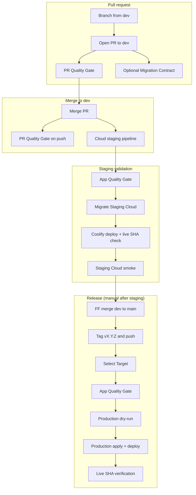

# CI/CD pipeline

> **Operational status:** Cloud staging and the tag-driven Cloud **production pipeline** are live in GitHub Actions. Customer-facing production **deployment** remains self-hosted Coolify until the Phase 3 cutover gates in the Cloud strategy doc close — see [`architecture.md`](/explanation/architecture). The self-hosted Compose path remains for local development and legacy full-stack Coolify deploys — see [`../how-to/deploy-to-coolify.md`](https://github.com/gidorah/catena/blob/dev/how-to/deploy-to-coolify.md). [ADR-040](https://github.com/gidorah/catena/blob/dev/decisions/040-supabase-cloud-bridge.md) is `implementation: partial`.

How Catena's GitHub Actions workflows, branch model, and deployment lanes fit together. This page is **understanding-oriented** — for day-to-day steps (opening PRs, verifying staging, cutting a release), see [`../how-to/work-with-prs-staging-and-releases.md`](https://github.com/gidorah/catena/blob/dev/how-to/work-with-prs-staging-and-releases.md).

For Coolify setup, environment variable names, and GitHub Environment configuration, see [`../how-to/deploy-to-coolify.md`](https://github.com/gidorah/catena/blob/dev/how-to/deploy-to-coolify.md). For test commands and local gates, see [`../how-to/run-the-test-suite.md`](https://github.com/gidorah/catena/blob/dev/how-to/run-the-test-suite.md).

## Branch model and release identity

Catena uses three Git references to separate integration from release:

| Reference | Role |
| --------- | ---- |
| `dev` | Integration branch. All feature PRs target `dev`. Each push runs the PR Quality Gate again and triggers the Cloud staging pipeline. |
| `main` | Release line. Updated only by fast-forward from a validated `dev` SHA before tagging. Regular feature commits do not land here directly. |
| `v*` SemVer tags | Production trigger. Pushing a tag such as `v0.2.0` starts the production Cloud pipeline for that commit. Any tag matching `v*` starts a workflow run; non-SemVer names (for example `vfoo`) fail at **Select Target**, not silently. |

Production releases rely on a hard identity chain enforced in `cloud-migrations.yml`:

```text
staging-validated commit SHA
  == origin/main tip
  == commit the release tag points at
```

All three must be the same 40-character Git commit. The workflow resolves the tag to its underlying commit with `git rev-parse vX.Y.Z^{commit}` — see troubleshooting in [`work-with-prs-staging-and-releases.md`](https://github.com/gidorah/catena/blob/dev/how-to/work-with-prs-staging-and-releases.md).

The production dry-run and apply jobs also require a successful staging run for the same SHA — migration apply, Coolify deploy, and Cloud smoke must all have completed on `dev` before production mutates anything.

## End-to-end flow



Release steps (fast-forward `main`, tag, push) are manual operator actions after staging is green — they are not automated on merge to `dev`.

Staging is the pre-production validation environment: it runs the same Cloud migration path, dashboard artifact, and smoke suite that production will use, but against the staging Supabase project and staging Coolify resource.

## Active workflows

| Workflow file | Display name | Triggers | Purpose |
| ------------- | ------------ | -------- | ------- |
| `integration-tests.yml` | PR Quality Gate | PR to `dev`, push to `dev`, `workflow_dispatch` | Static checks, parser/dashboard unit tests, local pgTAP, build, and PR-safe Playwright smoke. Cancels in-progress runs for the same PR or branch ref. |
| `migrations.yml` | Database Migration Contract | PR to `dev` when `supabase/migrations/**` changes, `workflow_dispatch` | Optional migration-path pgTAP check. Duplicates the required `db` lane for migration-only review ergonomics; branch protection uses the Quality Gate `db` job. |
| `cloud-migrations.yml` | Supabase Cloud Migration And Deploy | `dev` push → staging; `v*` tag push → production; `workflow_dispatch` → either | Staging path: migrate, deploy, smoke. Production path: dry-run, apply, deploy. Manual fallback for bootstrap or verification. |
| `release-e2e.yml` | Nightly Local E2E Gate | Daily schedule, `workflow_dispatch` on `dev` | Broader local Playwright release suite against disposable Supabase — not part of the PR or Cloud deploy gates. |

### PR Quality Gate jobs

On pull requests and pushes to `dev`:

| Job | What it validates |
| --- | ----------------- |
| Fork PR Guard | Blocks untrusted fork PRs from receiving a green repository signal. |
| Static Checks | Lint, test governance, typecheck. |
| Parser Vitest | `@catena/gaeb-parser` regression suite. |
| Dashboard Vitest | Dashboard unit and route-handler tests. |
| DB pgTAP | Disposable local Supabase stack + `npm run test:db`. |
| Build | Monorepo build with placeholder public Supabase values. |
| Playwright PR Smoke | Local E2E smoke after `db`; `continue-on-error: true` today — informational only; not required for merge. |

Fork PRs fail the guard job; other jobs are skipped for them.

### Cloud pipeline jobs

After `select-target` resolves environment and SHA:

| Job | When | What it does |
| --- | ---- | ------------ |
| App Quality Gate | Staging and production | Checks out the immutable target SHA; for production, verifies tag/main identity; runs lint, governance, typecheck, parser/dashboard tests, local pgTAP, build, and Cloud Compose artifact validation. |
| Migrate Staging Cloud | Staging only | Verifies SHA is current `origin/dev`; dry-runs and applies migrations to staging Supabase; pins `CATENA_DEPLOY_SHA` in Coolify; triggers deploy; verifies Coolify commit and live `/api/health/version`; runs Cloud staging smoke. Targets `supabase-staging` GitHub Environment. |
| Production Cloud Dry Run | Production only | Requires successful staging migration/deploy/smoke for the target SHA; dry-runs production migrations. Targets `supabase-production` GitHub Environment. |
| Production Cloud Apply | Production only | Re-verifies staging success and tag/main identity; applies migrations; checks migration sync/drift; pins SHA, deploys via Coolify API, verifies deployment commit and live `/api/health/version`. No mutating Cloud smoke on production. Targets `supabase-production`. |

## Local-only vs Cloud-remote lanes

Catena deliberately separates **disposable local validation** from **remote Cloud mutation**:

| Concern | Local lane | Cloud-remote lane |
| ------- | ---------- | ----------------- |
| Migrations | Supabase CLI disposable stack; pgTAP via `test:db`; self-hosted Coolify uses Compose `migrator` | `supabase link` + `supabase db push --linked` in `cloud-migrations.yml` |
| App deploy | Not automated in CI for self-hosted mode | Coolify API deploy with SHA-pinned `CATENA_DEPLOY_SHA` build arg |
| Browser smoke | PR smoke and nightly release E2E against `local-e2e` | Staging-only `test:e2e:cloud-smoke` after live SHA verification |
| Data safety | Reset/seed allowed on disposable CLI stack | Never run `db reset`, seed, or destructive pgTAP against Cloud staging/production |

The layered test model is documented in [ADR-041](https://github.com/gidorah/catena/blob/dev/decisions/041-layered-test-architecture.md). Cloud topology and the dashboard-only Compose artifact are in [ADR-040](https://github.com/gidorah/catena/blob/dev/decisions/040-supabase-cloud-bridge.md) and [ADR-043](https://github.com/gidorah/catena/blob/dev/decisions/043-cloud-mode-compose-artifact.md).

### ADR-041 test targets

| Target | One command | CI hook |
| ------ | ----------- | ------- |
| `local-dev` | `npm run docker:up` (mutable Compose dev) | Not a CI gate |
| `local-test` | `npm run test:db` | PR Quality Gate `db` lane |
| `local-e2e` | `npm run test:e2e` | PR Quality Gate Playwright smoke (informational today) |
| `staging` | `npm run test:e2e:cloud-smoke` (operator credentials) | Cloud staging pipeline after live SHA check |
| `prod` | No mutating tests | Production apply verifies live `/api/health/version` only |

## Deploy topology (brief)

Two deploy artifacts coexist:

1. **Self-hosted mode** — `docker-compose.yml` runs the full Supabase stack plus dashboard on Coolify. Migrations apply through the Compose `migrator` at deploy time, not through `cloud-migrations.yml`.
2. **Cloud mode** — `docker-compose.cloud.yml` deploys only the dashboard. Supabase Cloud owns Postgres, Auth, Storage, and remote migration history. GitHub Actions applies migrations before triggering Coolify.

Cloud staging and production dashboards are rebuilt from the same immutable commit SHA with environment-specific public Supabase URLs and site URLs. Raw Git-push auto-deploy on Cloud Coolify resources must stay disabled so migrations always precede deploy.

Details: [`deploy-to-coolify.md`](https://github.com/gidorah/catena/blob/dev/how-to/deploy-to-coolify.md).

## Concurrency and safety

**Cancellable PR work.** The PR Quality Gate uses `cancel-in-progress: true` so stale commits on a PR or `dev` do not waste runner time.

**Non-cancellable Cloud mutation.** Staging and production Cloud jobs use concurrency groups (`cloud-migrations-staging`, `cloud-migrations-production`) with `cancel-in-progress: false`. A migration apply or deploy in flight is not interrupted by a newer push.

**Migrations before deploy.** Staging refuses deploy when `apply_migrations` is false but `trigger_deploy` is true. Production tag pushes always apply migrations and deploy in order. Coolify receives the target SHA only after migration dry-run/apply steps succeed.

**Stale SHA protection.** Staging migration refuses to run if `origin/dev` has moved past the workflow's target SHA. Production requires a recorded successful staging run for the exact release SHA.

**Migration drift checks (asymmetric).** Staging lists linked migration history before and after apply but does not fail the workflow on drift patterns. Production apply runs programmatic sync verification after `db push` and fails when `supabase migration list --linked` shows unapplied repo migrations (Local column marked, Remote empty) or remote-only migrations not present in the release codebase (Remote column marked). Do not assume staging drift visibility implies staging will block the same condition — see troubleshooting in [`work-with-prs-staging-and-releases.md`](https://github.com/gidorah/catena/blob/dev/how-to/work-with-prs-staging-and-releases.md).

**Live verification.** After Coolify deploy, workflows poll the deployment record and `/api/health/version` until the reported commit matches the pinned SHA. See [`apps/dashboard/src/app/api/health/version/route.ts`](https://github.com/gidorah/catena/blob/dev/../apps/dashboard/src/app/api/health/version/route.ts).

## What runs when

| Event | Workflows / jobs |
| ----- | ---------------- |
| Open or update PR to `dev` | PR Quality Gate (all jobs). Migration Contract additionally if migration files changed. |
| Merge / push to `dev` | PR Quality Gate on push; Cloud staging pipeline (`App Quality Gate` → `Migrate Staging Cloud`). |
| Push SemVer tag `v*` | Cloud production pipeline (`App Quality Gate` → `Production Cloud Dry Run` → `Production Cloud Apply`). |
| Nightly (02:17 UTC) or manual on `dev` | Nightly Local E2E Gate — broader Playwright, no Cloud mutation. |
| Manual `workflow_dispatch` on `cloud-migrations.yml` | Operator-selected environment, SHA, and apply/deploy flags — bootstrap, dry-run verification, or emergency fallback. |

## Related docs and decisions

- [`work-with-prs-staging-and-releases.md`](https://github.com/gidorah/catena/blob/dev/how-to/work-with-prs-staging-and-releases.md) — task-oriented release checklist.
- [`deploy-to-coolify.md`](https://github.com/gidorah/catena/blob/dev/how-to/deploy-to-coolify.md) — Coolify resources, env vars, GitHub Environment secrets, tag protection.
- [`run-the-test-suite.md`](https://github.com/gidorah/catena/blob/dev/how-to/run-the-test-suite.md) — local commands and CI lane mapping.
- [`architecture.md`](/explanation/architecture) — runtime topology.
- [ADR-040](https://github.com/gidorah/catena/blob/dev/decisions/040-supabase-cloud-bridge.md), [ADR-041](https://github.com/gidorah/catena/blob/dev/decisions/041-layered-test-architecture.md), [ADR-043](https://github.com/gidorah/catena/blob/dev/decisions/043-cloud-mode-compose-artifact.md).
